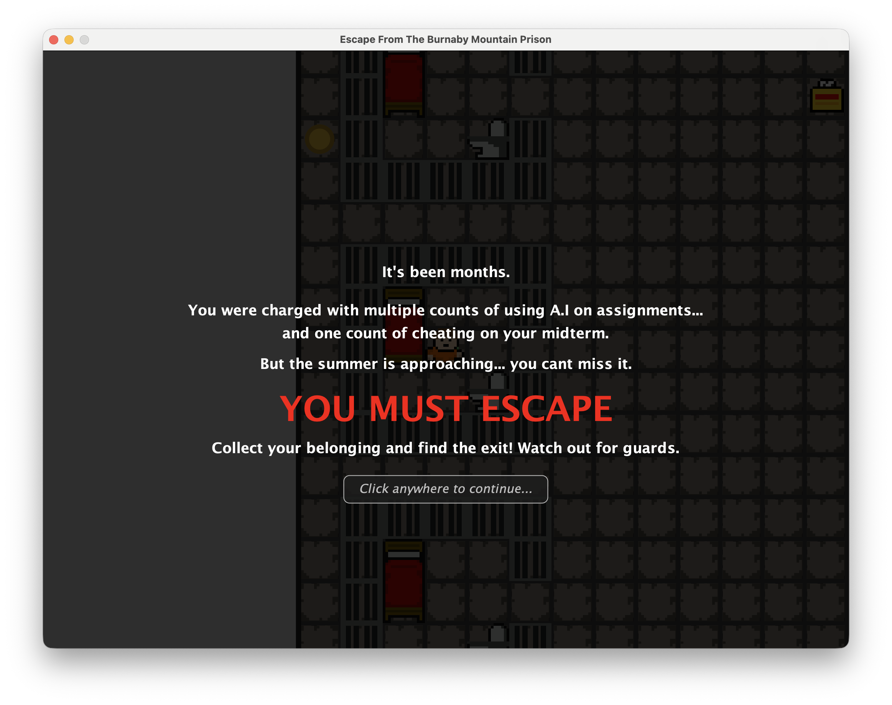
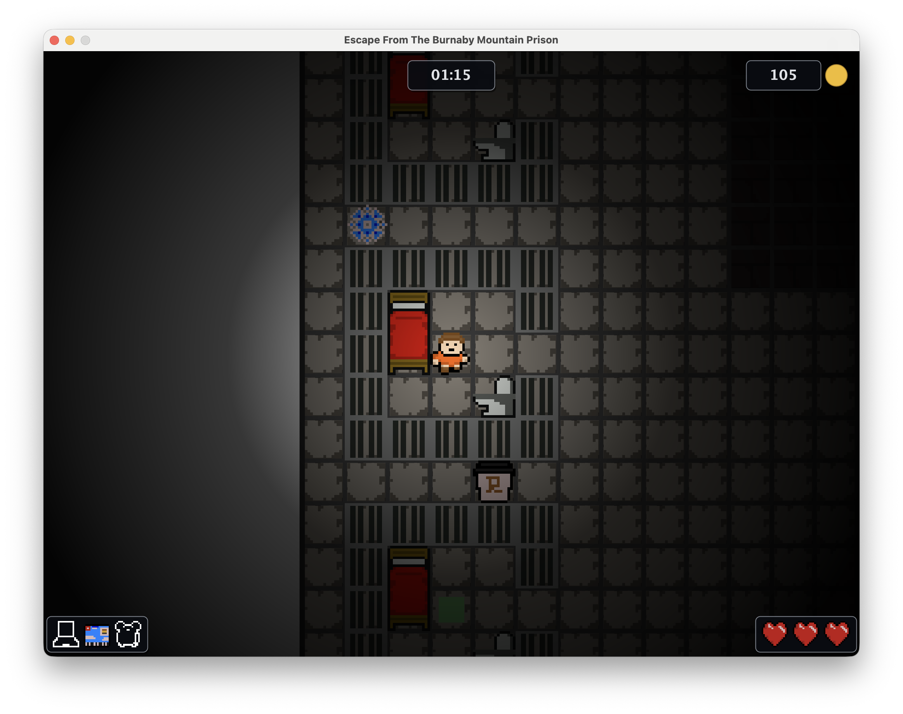

# Escape from the Burnaby Mountain Prison

## Project Overview

Escape from the Burnaby Mountain Prison is a 2D tile-based prison escape game written in Java. The player must move through the prison, collect all three rewards, avoid guards and hazards, and reach the exit to win.

<p align="center">
  
  
</p>

Video Demo: https://youtu.be/UdoQZyGOStY?si=e-fTa_xbtm_YT8h7

## How to Play

- Use keyboard controls to move the player (WASD / Arrow Keys)
- Collect all three rewards (Laptop, Pet Raccoon & Student ID)
- Avoid patrolling guards and static hazards
- Reach the exit tile with all available rewards to win the game

## My Contributions

This project was developed by a team of five students as part of the CMPT276 (Intro to Software Engineering) course at Simon Fraser University. The team members who contributed are Arsh Behniwal, Dominic Janus, Jagdeep Sidhu, Nick Zhou and Tarnjot Aujla.

My specific contributions included:

- Engineered the core game objects, including power-ups and static enemies, and designed the logic for spawning precise quantities onto their designated tiles.

- Programmed a variety of unique power-up mechanics, such as a "coffee" speed boost, a "doctor's note" for life restoration, and a "Snow Day" effect that temporarily freezes enemy guard movement.

- Developed complex hazard effects to challenge the player, including point reductions for colliding with bears or handcuffs, and an inverted movement penalty caused by "spoiled milk".

- Implemented the dynamic scoring system that calculates and updates the player's point total based on their interactions with the environment's hazards and rewards.

## Tech Stack

*   **Language:** Java
*   **Build Tool:** Maven
*   **Testing:** JUnit, JaCoCo
*   **UI/Graphics:** Java Swing / AWT

## Build

Build the project from the repository root with:

```bash
mvn clean package
```

This creates the game jar at:

```text
target/Spring2026Team10-1.0-SNAPSHOT.jar
```

If you want to build the jar without running the tests, use:

```bash
mvn clean package -DskipTests
```

## Run

Run the packaged jar with:

```bash
java -jar target/Spring2026Team10-1.0-SNAPSHOT.jar
```

You can also run the game directly from an IDE by starting:

```text
Spring2026Team10.Main
```

## Test

Run the full automated test suite with:

```bash
mvn test
```

Run a single test class with:

```bash
mvn test -Dtest=TestGuard
```

Examples of other targeted test runs:

```bash
mvn test -Dtest=TestGameAndPlayer
mvn test -Dtest=TestPrisonMapAndPanel
mvn test -Dtest=TestPowerups
mvn test -Dtest=TestHazard
mvn test -Dtest=TestHazardsAndPowerups
mvn test -Dtest=TestRewards
mvn test -Dtest=TestSound
```

JaCoCo coverage reports are generated after the test run and can be found at:

```text
target/site/jacoco/index.html
```

## Documentation (Javadocs)

Generate the Javadoc documentation with: 

```bash
mvn javadoc:javadoc
```

The generated documentation can be found at: 

```text
target/site/reports/apidocs/index.html
```

A Javadoc JAR is also generated: 

```text
target/Spring2026Team10-1.0-SNAPSHOT-javadoc.jar
```
